## 1. Download Installer Omada Controller

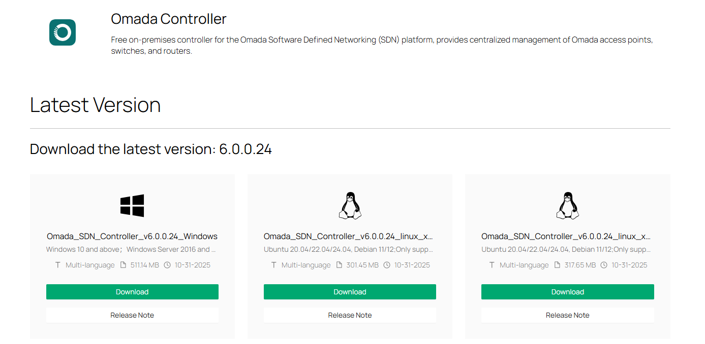

Pada halaman resmi TP-Link Omada, pilih versi terbaru Omada_SD N_Controller_v6.0.0.24_Windows kemudian klik Download. File akan terunduh dalam bentuk ZIP.

## 2. Ekstrak File ZIP

Setelah proses download selesai, Anda akan mendapatkan file:

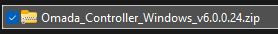

Ekstrak file tersebut, lalu jalankan file Omada Controller.exe.

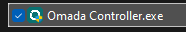

## 3. Jalankan Installer

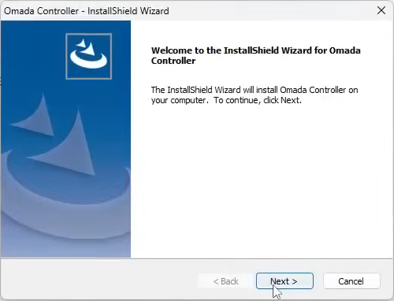


Installer Omada akan terbuka melalui InstallShield Wizard.

Langkah yang dilakukan:

1. Klik Next untuk melanjutkan instalasi.
2. Tentukan folder instalasi (default berada di C:\Program Files\Omada Controller) dan klik Next.
3. Proses instalasi berjalan, tunggu hingga selesai.


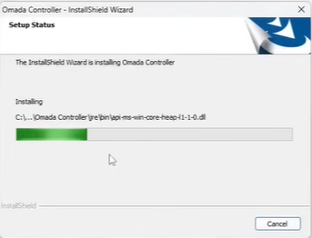

## 4. Instalasi Selesai

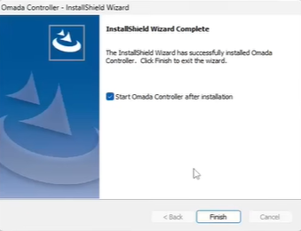

Pada halaman terakhir wizard, pastikan opsi Start Omada Controller after installation dicentang.
Klik Finish untuk membuka Omada Controller.

## 5. Akses Omada Controller Web UI

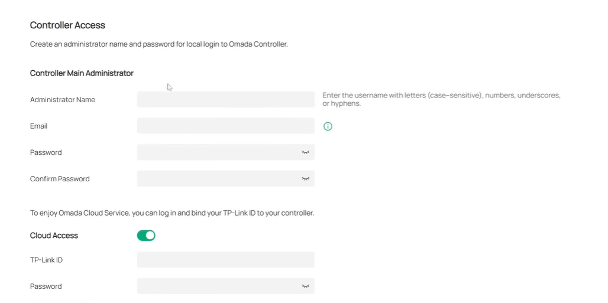

---

Browser otomatis membuka halaman:

`https://localhost:8043`

Ini adalah portal web untuk konfigurasi awal Omada Controller. Anda akan melihat halaman Welcome to use Omada Controller, klik Let’s Get Started.

## 6. Membuat Akun Administrator Lokal


Pada tahap ini, isi data:

- Administrator Name
- Email
- Password
- Confirm Password

Akun ini digunakan untuk login lokal ke controller.

## 7. Integrasi dengan Omada Cloud (Opsional)

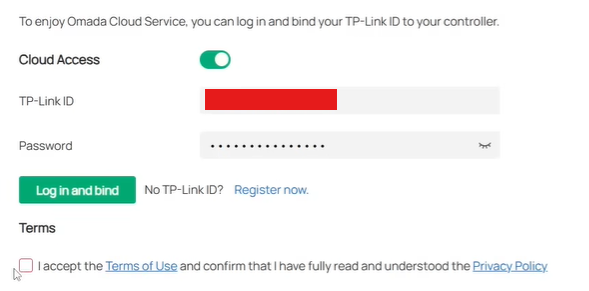

Jika Cloud Access aktif:

- Masukkan TP-Link ID (email TP-Link)
- Masukkan password TP-Link ID
- Klik Log in and bind
- Centang Terms of Use

Fitur ini memungkinkan Anda mengelola controller dari mana saja melalui Omada Cloud.


## 8. Memulai Setup Baru

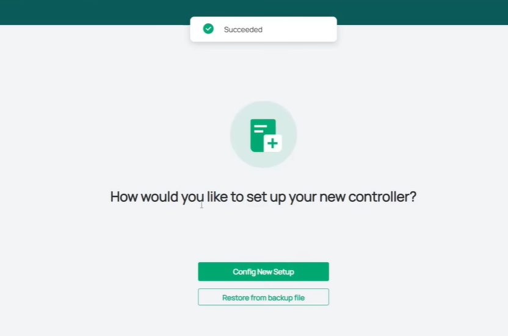

Setelah login pertama kali, Omada menampilkan pilihan:

- Config New Setup → untuk membuat konfigurasi baru
- Restore from backup file → untuk memulihkan konfigurasi lama

Jika belum ada backup, pilih Config New Setup.

## 9. Omada Setup Wizard – Informasi Controller

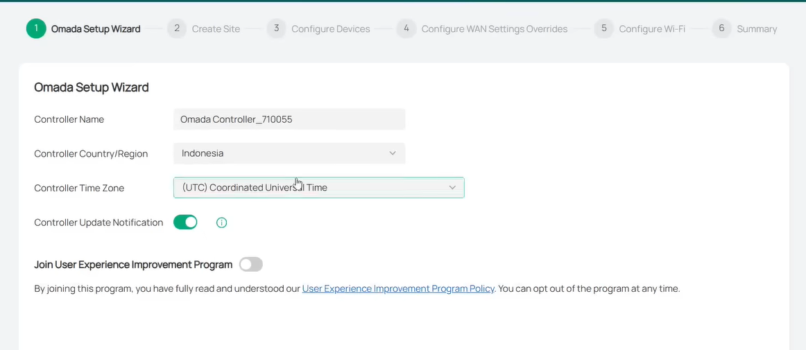

Isi informasi dasar controller:

- Controller Name → nama identitas controller
- Country/Region → pilih Indonesia
- Time Zone → pilih UTC +7 (Jakarta) agar sinkron waktu
- Controller Update Notification → aktifkan agar dapat notifikasi update
- User Experience Program → opsional, biasanya dinonaktifkan

Klik Next.

## 10. Create Site (Membuat Site Baru)

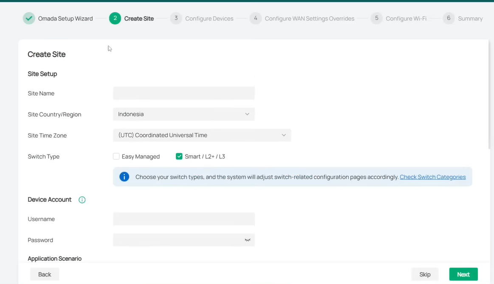

Pada langkah ini Anda membuat site tempat semua perangkat Omada akan dikelola.

Isi bagian penting:

- Site Name → nama lokasi (misal: “Kampus UNS”, “Gedung A”)
- Country/Region → Indonesia
- Time Zone → UTC+7
- Switch Type → centang Smart / L2+ / L3
- Device Account → username & password yang akan dipush ke perangkat saat adopt (sangat penting)

Selanjutnya pilih Application Scenario, misalnya:

- Offic
- Campus
- Hotel
- dll.


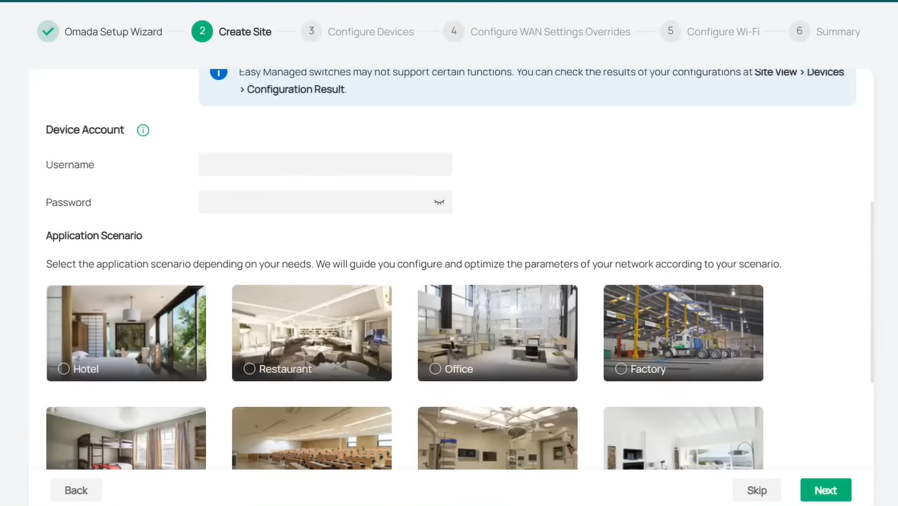

Klik Next.

## 11. Configure Devices (Adopsi Perangkat)


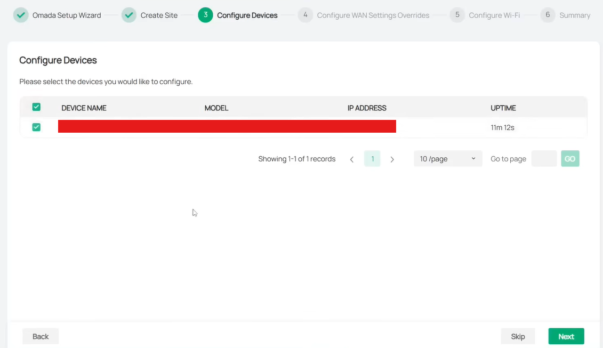

Omada akan mendeteksi perangkat yang sudah berada dalam status Pending Adoption.

- Checklist perangkat yang ingin di-adopt
- Pastikan IP address dan model sesuai
- Klik Next

Perangkat Anda akan otomatis dipersiapkan untuk manajemen.

## 12. Configure WAN Settings Overrides (Opsional)


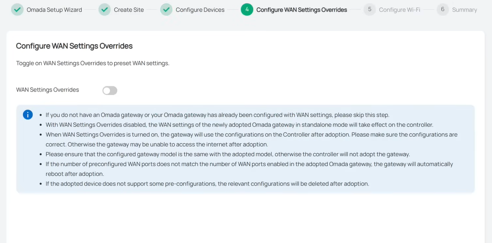

Langkah ini hanya dipakai jika Anda menggunakan Omada Gateway (ER605/ER7206).

Jika Anda tidak memakai Omada Gateway, biarkan OFF dan klik Next.

## 13. Configure Wi-Fi


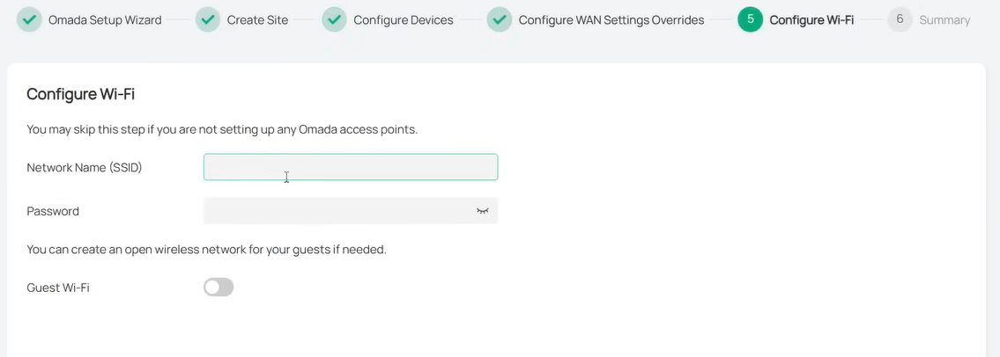

Jika Anda ingin membuat SSID langsung dari wizard:

- Network Name (SSID)
- Password
- Aktifkan Guest Wi-Fi jika dibutuhkan
- Jika tidak ingin mengatur SSID sekarang → Skip.

Klik Next.

# 14. Summary (Ringkasan Konfigurasi)


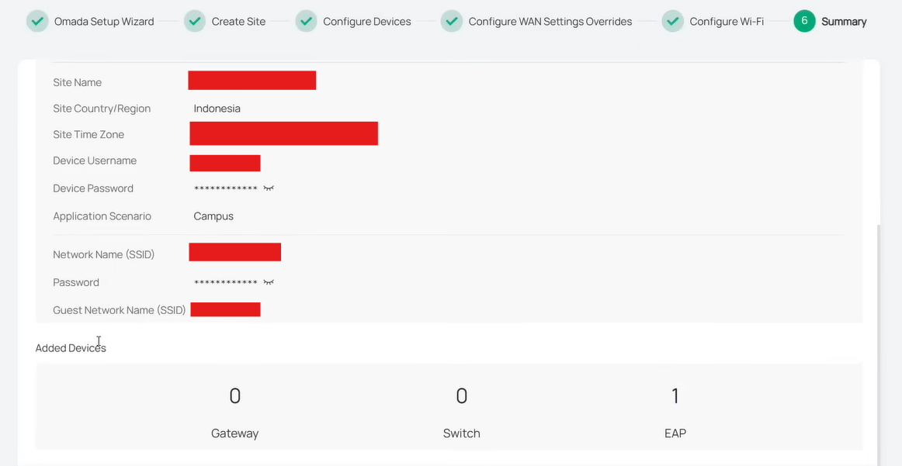

Omada menampilkan seluruh konfigurasi:

- Site name, time zone
- Device username/password
- SSID & Guest SSID (jika dibuat)
- Jumlah perangkat yang berhasil diadopsi

Jika sudah benar klik Finish.

# 15. Controller Berhasil Berjalan


Terakhir muncul window informasi:

```
MongoDB server started
Omada initialization finished
Device connector server started
Omada Controller started
```

Klik Launch untuk membuka dashboard Omada Controller.

Controller siap digunakan untuk konfigurasi lebih lanjut (SSID, VLAN, jaringan per-site, RADIUS, PPSK, dll).
