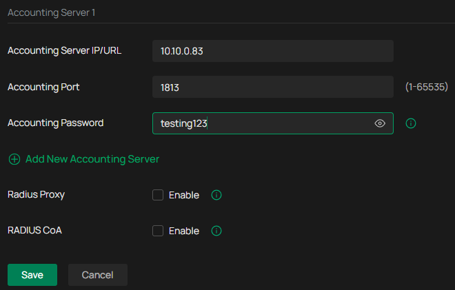

setelah tahap instalasi Sever Omada dan Radius berhasil, tahap selanjutnya adalah integrasi database Radius dengan Omada Controller. Konfigurasi terletak pada Site Omada controller kemudian pilih network config > RADIUS Profile.

---

klik create new RADIUS Profile untuk membuat profile baru yang akan di integrasikan dengan server radius.

---

buat profile sesuai dengan kebutuhan. isikan IP Address dari server Radius dan port default radius dan juga Auth Password sesuai pada server radius. aktifkan RADIUS accounting untuk mencatat log koneksi.

---

isikan IP server untuk accounting dan port serta accounting password.

---

Langkah selanjutnya yaitu konfigurasi pada sisi WiFi (WLAN) perangkat TP-LINK. Buka menu Network Config kemudian pilih WLAN.

---

pilih create New WLAN Network untuk konfigurasi SSID.

---

Isi nama SSID sesuai keinginan. untuk security pilih PPSK with RADIUS, dan Radius server pilih profil yang sudah dibuat sebelumnya. untuk auth type pilih Generic Radius with bound mac. Mac address format pilih sesuai kebutuhan. 
